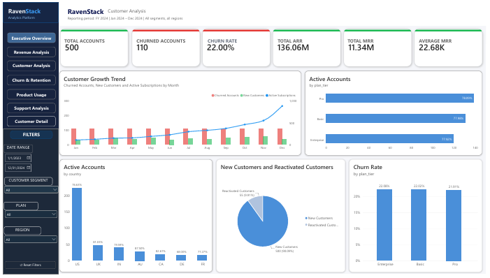
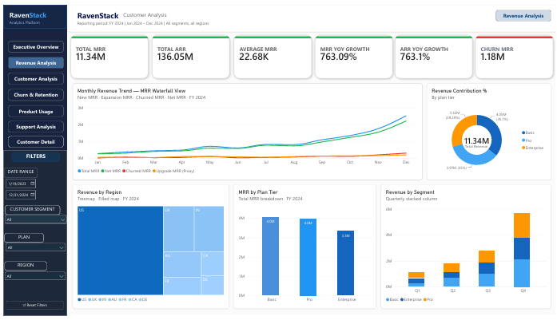
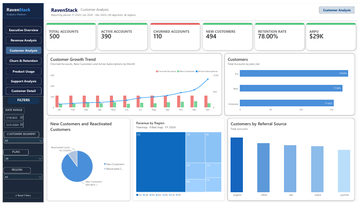
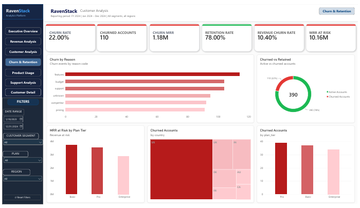
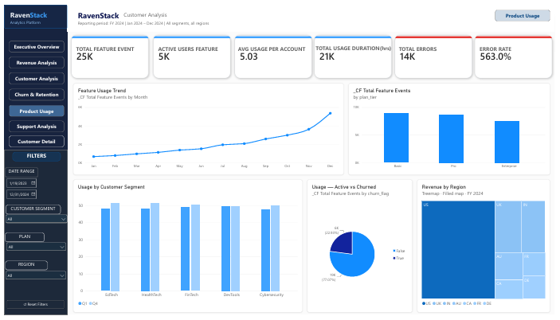
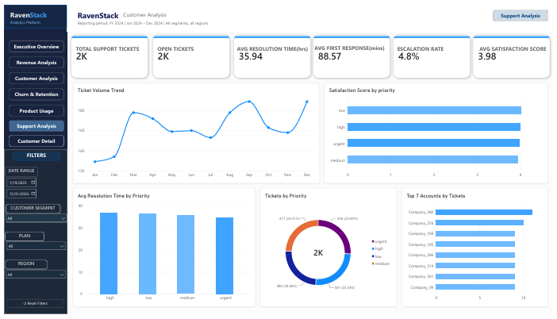
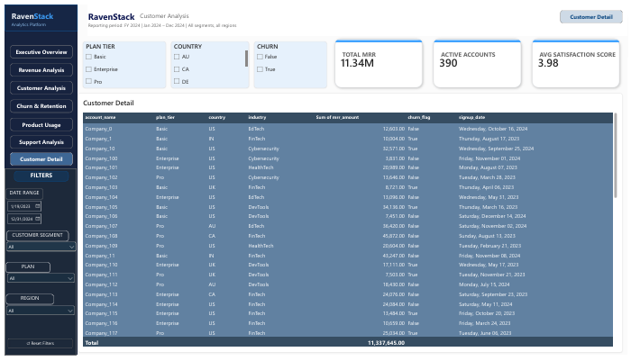

## 📊 Power BI Dashboard

The Power BI dashboard contains seven analytical pages covering revenue, customers, churn, product usage, and support performance.

### 1. Executive Overview

Provides a high-level view of customers, revenue, churn, and overall business performance.

---

### 2. Revenue Analysis

Analyzes MRR, ARR, revenue trends, plan-level revenue, and revenue distribution.

---

### 3. Customer Analysis

Examines customer growth, retention, plans, regions, and acquisition sources.

---

### 4. Churn & Retention

Analyzes churn rate, churn reasons, revenue churn, MRR at risk, and churn across plans and countries.

---

### 5. Product Usage

Analyzes feature usage, active feature users, usage trends, and product engagement.

---

### 6. Support Analysis

Examines support ticket volume, response time, resolution time, escalation rate, SLA performance, and customer satisfaction.

---

### 7. Customer Detail

Provides a detailed customer-level view for deeper analysis.

